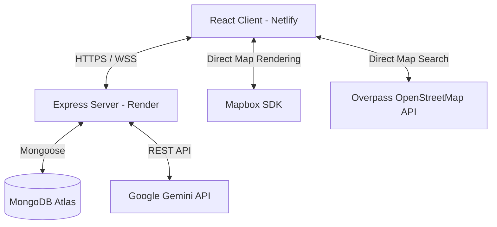

# 🚀 HealthTrack: Production-Ready Full-Stack Wellness Cockpit

HealthTrack is a premium, state-of-the-art wellness application built on the MERN stack. It features real-time geolocation tracking (Socket.io + Mapbox), detailed calorie analytics (Chart.js), dynamic gamification, and an AI Health Suite (powered by Google Gemini).

---

## 🛠️ Architecture & Technology Stack



### Frontend Stack
* **Core:** React (Vite), React Router
* **Styling:** Vanilla CSS, Tailwind CSS, Framer Motion
* **Analytics & Visualization:** Chart.js, React-Chartjs-2
* **Maps & Geolocation:** Mapbox GL, Overpass OSM API
* **Real-time Synchronization:** Socket.io Client
* **HTTP Client:** Axios with response/request interceptors

### Backend Stack
* **Core:** Node.js, Express.js
* **Security & Optimization:** Helmet (CSP configured), Compression, Express Rate Limit, Cookie Parser
* **Real-time Server:** Socket.io
* **Database Object Modeling:** Mongoose, MongoDB
* **API Documentation:** Swagger UI (Express-Swagger)
* **Testing:** Jest, MongoDB Memory Server

---

## 📂 Project Structure

```
healthtrack-fullstack/
├── healthtrack-backend/         # Express API Server
│   ├── config/                  # DB, mailer, and swagger configs
│   ├── controllers/             # Request handlers (auth, tracking, AI, entries)
│   ├── middleware/              # Authentication, Validation, Security & Errors
│   ├── models/                  # Mongoose Schemas (User, Entry, Tracker)
│   ├── routes/                  # Express route declarations
│   ├── scripts/                 # Database seed scripts
│   ├── tests/                   # Jest test suite
│   ├── Dockerfile               # Production container definition
│   └── server.js                # Entry point
│
├── render.yaml                  # Render Blueprint definition (automated setup)
└── healthtrack-frontend/        # React (Vite) Single Page Application
    ├── public/                  # Static assets
    ├── src/                     # Application source code
    │   ├── components/          # Reusable React components (auth, maps, charts)
    │   ├── contexts/            # Theme & Authentication context providers
    │   ├── hooks/               # Geolocation & UI custom hooks
    │   ├── pages/               # Main view modules (Dashboard, Goals, AI Suite)
    │   └── services/            # Centralized API and Socket handlers
    ├── netlify.toml             # Netlify SPA redirect rules
    └── vite.config.js           # Vite bundler configurations
```

---

## ⚙️ Environment Variables Config

### 💻 Backend Configuration (`healthtrack-backend/.env`)
Create a `.env` file in the backend directory:
```env
PORT=5000
NODE_ENV=production
MONGO_URI=mongodb+srv://<username>:<password>@cluster.mongodb.net/healthtrack
JWT_SECRET=your_long_random_access_token_secret
JWT_REFRESH_SECRET=your_long_random_refresh_token_secret
ENABLE_SOCKETIO=true
FRONTEND_URL=https://healthtrack05.netlify.app
MAPBOX_TOKEN=pk.eyJ1Ijo...
GEMINI_API_KEY=AIzaSy...
```

### 🎨 Frontend Configuration (`healthtrack-frontend/.env`)
Create a `.env` file in the frontend directory:
```env
VITE_API_URL=https://your-backend-render-url.onrender.com/api
VITE_SOCKET_URL=https://your-backend-render-url.onrender.com
VITE_MAPBOX_TOKEN=pk.eyJ1Ijo...
```

---

## 🚀 Deployed Hosting Guide

### 1. Backend on Render
1. Sign up on [Render](https://render.com) using your GitHub account.
2. Click **New +** -> **Blueprint**.
3. Connect your `healthtrack-fullstack` repository.
4. Render will read the `render.yaml` file automatically:
   * It will create the **healthtrack-backend** web service.
   * It will prompt you to input the environment variables (`MONGO_URI`, `FRONTEND_URL`, etc.).
5. Click **Approve**. Render will automatically build the backend service and assign a public domain (e.g., `https://healthtrack-backend-xxxx.onrender.com`).

### 2. Frontend on Netlify
1. Sign up on [Netlify](https://netlify.com) using your GitHub account.
2. Click **Add new site** -> **Import an existing project** -> Select the same `healthtrack-fullstack` repository.
3. Configure the following build settings:
   * **Base Directory:** `healthtrack-frontend`
   * **Build Command:** `npm run build`
   * **Publish Directory:** `dist`
4. Add the frontend environment variables (ensure `VITE_API_URL` uses the Render backend URL + `/api`).
5. Click **Deploy**. Netlify handles SPA routing fallback automatically.

---

## 📡 API Documentation

Interactive Swagger API docs are available at: `http://localhost:5000/api-docs` (locally) or `https://your-backend-render-url.onrender.com/api-docs` (in production).

### Core Endpoints:
| Method | Endpoint | Description | Auth Required |
|--------|----------|-------------|---------------|
| `POST` | `/api/auth/register` | Register a new user | No |
| `POST` | `/api/auth/login` | Login and acquire JWT | No |
| `POST` | `/api/auth/logout` | Clear user refresh token | No |
| `GET`  | `/api/dashboard/today` | Fetch logged wellness numbers | Yes |
| `POST` | `/api/entries` | Add weight, workout, or meal entry | Yes |
| `POST` | `/api/track/session` | Create real-time GPS tracking session | Yes |
| `POST` | `/api/ai/chat` | Query AI Wellness Coach | Yes |

---

## 🔧 Troubleshooting & Health Checks

* **Health Endpoint:** Query `/api/health` to confirm server status and database connectivity.
* **CORS Blocked:** Verify `FRONTEND_URL` in the Render environment matches your Netlify URL *exactly* (without a trailing slash, e.g., `https://healthtrack05.netlify.app`).
* **Socket.io Connections Fail:** Ensure `ENABLE_SOCKETIO` is set to `true` on Render and `VITE_SOCKET_URL` is set to the Render domain in Netlify.
* **Cold Starts:** On the free tier, if the backend doesn't receive a request for 15 minutes, Render puts the service to sleep. The next request can take 50 seconds to spin it back up.
